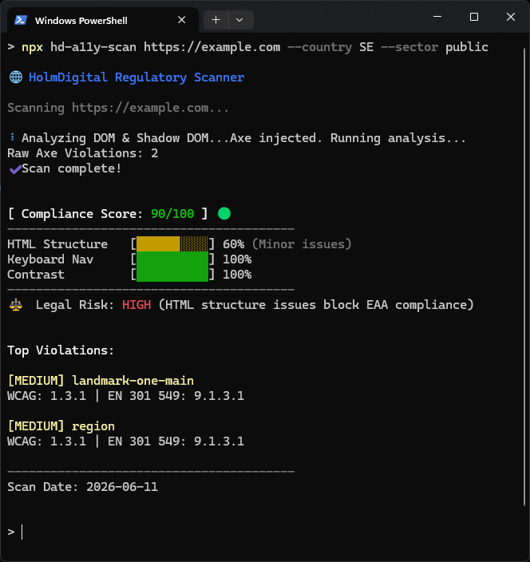

# Holm Digital Accessibility Ecosystem

> WCAG and EN 301 549 accessibility testing that maps every failure to national law and the right enforcement body, across 17 jurisdictions.

[](https://www.npmjs.com/package/@holmdigital/engine)
[](https://www.npmjs.com/package/@holmdigital/engine)
[](./LICENSE)
[](https://www.npmjs.com/package/@holmdigital/standards)

Most scanners (axe, Pa11y, Lighthouse) tell you **what** is broken. This ecosystem also tells you **which law** you are breaking and **who enforces it**: it maps each WCAG 2.1/2.2 failure to EN 301 549 and the relevant national accessibility law, and routes it to the correct enforcement body, for both public sector (WAD) and private sector (EAA) sites. Open source, MIT licensed, ~11k+ downloads across the package family.

## Quick start (10 seconds, no install)

```bash
# Scan any URL and get a regulation-mapped report in your terminal:
npx hd-a11y-scan https://example.com --country SE --sector public
```

Add a PDF report, a JUnit file for CI, or a ready-to-publish accessibility statement:

```bash
npx hd-a11y-scan https://example.com \
  --country SE --sector private \
  --pdf report.pdf --junit report.xml --statement statement.html
```

That is the whole loop: point it at a URL, get back violations, the regulation each one maps to, the enforcing authority, and publishable artifacts.



## What you get

- **Regulatory mapping, not just findings.** Every WCAG failure is mapped to EN 301 549 and national law across 12 languages and 16 countries plus the EU (17 jurisdictions). See the full list below.
- **Sector-aware routing.** Distinguishes public sector (WAD / ADA Title II) from private sector (EAA / DDA / ADA Title III / HHS Section 504) via `--sector public|private`, and routes to the correct enforcement body and national law. Encodes the EAA microbusiness exemption (<10 employees AND ≤2M EUR turnover, services only) on all 7 EAA private-sector entries.
- **Risk assessment** based on real enforcement practice (Digg, Uutilsynet, Logius, and others).
- **CI/CD-grade reporting.** JUnit XML with full metadata, success counts, and failure snippets for DevOps dashboards.
- **Publishable statements.** Generates modern, localized accessibility statements from typed JSON templates.

<details>
<summary><strong>All 17 jurisdictions covered</strong></summary>

- 🇸🇪 **DOS-lagen** (Sweden)
- 🇫🇮 **Laki digitaalisten palvelujen saavutettavuudesta** (Finland)
- 🇳🇴 **Forskrift om universell utforming av IKT** (Norway)
- 🇩🇰 **Lov om tilgængelighed** (Denmark)
- 🇳🇱 **Digitoegankelijk** (Netherlands)
- 🇩🇪 **BITV 2.0** (Germany)
- 🇫🇷 **RGAA** (France)
- 🇪🇸 **UNE 139803** (Spain)
- 🇮🇹 **Legge Stanca** (Italy)
- 🇵🇹 **DL 83/2018** (Portugal)
- 🇵🇱 **Ustawa o dostępności cyfrowej** (Poland)
- 🇬🇧 **PSBAR** (UK) / 🇮🇪 **S.I. No. 358/2020** (Ireland)
- 🇺🇸 **Section 508** (federal, GSA) / **ADA Title II** (state+local, DOJ) / **ADA Title III** (private, DOJ) / **HHS Section 504** (HHS-funded healthcare/research, OCR). ADA Title II deadline 2027-04-26 for 50k+ population (extended by DOJ Interim Final Rule 2026-04-20), HHS Section 504 WCAG benchmark from 2027-05-11 for 15+ employees (extended by HHS IFR 2026-09266).
- 🇨🇦 **AODA** (Ontario) / **ACA** (Canada federal)
- 🇦🇺 **DDA 1992** (Australia, public and private sectors)

</details>

## Packages

This monorepo ships three NPM packages plus a documentation wiki.

### [@holmdigital/engine](./packages/engine)
Regulatory test engine with virtual-DOM analysis for Shadow DOM and SPA support, i18n, premium V2 accessibility-statement generation, and automatic badge support.

```bash
npm install @holmdigital/engine
```

CLI:
```bash
npx hd-a11y-scan <url> [options]
```

Options:
- `--lang <code>` : language (`en`, `sv`, `no`, `fi`, `da`, `de`, `fr`, `es`, `nl`, `it`, `pt`, `pl`, `en-gb`, `en-us`, `en-ca`, `en-au`)
- `--threshold <level>` : severity threshold (`critical`, `high`, `medium`, `low`). Default: `high`
- `--ci` : CI mode (exit code 1 on failures at or above threshold)
- `--json` : output results as JSON
- `--pdf <path>` : generate a PDF report
- `--plain` (or `--audience plain`) : plain-language report and PDF for non-technical recipients
- `--statement <path>` : generate an accessibility statement (Premium V2 HTML)
- `--format <type>` : statement format (`html`, `md`). Default: `html`
- `--junit <path>` : generate JUnit XML for CI dashboards
- `--country <code>` : country for enforcement body (e.g. `SE`, `NO`, `DE`, `IT`, `PT`, `PL`, `AU`)
- `--sector <type>` : `public` (WAD) or `private` (EAA). Default: `public`
- `--org <name>` / `--email <email>` / `--phone <number>` : statement metadata
- `--response-time <val>` / `--publish-date <date>` : statement metadata
- `--viewport <size>` : viewport (`mobile`, `tablet`, `desktop`, or `1024x768`)
- `--generate-tests` : emit pseudo-code automation scripts for verification
- `--invalid-https-cert` : allow self-signed certs ⚠️ (trusted environments only)
- `--api-key <key>` / `--cloud-url <url>` : upload to HolmDigital Cloud Dashboard

> ⚠️ `--invalid-https-cert` should only be used in trusted environments. *(Contributed by [@FerdiStro](https://github.com/FerdiStro))*

### [@holmdigital/components](./packages/components)
29 accessible React components with built-in regulatory compliance, including a 12-locale `AccessibilityStatement` component (EN, SV, NO, FI, DA, NL, DE, FR, ES, IT, PT, PL, with NB/DK and EN-GB/US/CA/AU aliases).

```bash
npm install @holmdigital/components
```

```tsx
import { Heading, Button, FormField, ErrorSummary, AccessibilityStatement } from '@holmdigital/components';

<Heading level={1}>Kontakta oss</Heading>

<FormField id="email" label="E-postadress" type="email" required
           helpText="Vi delar aldrig din e-post." error={errors.email} />

<Button variant="primary" isLoading={isSaving}>Skicka</Button>

<AccessibilityStatement
  country="SE"
  sector="public"
  organizationName="Stockholms kommun"
  websiteUrl="https://stockholm.se"
  complianceLevel="partial"
  lastReviewDate={new Date()}
  contactEmail="tillganglighet@stockholm.se"
  locale="sv"
/>
```

> Gotcha: `Checkbox` fires both `onChange` (native) and `onCheckedChange(checked)`. `Select` uses a custom compound pattern (`SelectTrigger`/`SelectContent`/`SelectItem`), no Radix dependency. Full catalog: [docs/reference/components.md](./docs/reference/components.md).

### [@holmdigital/standards](./packages/standards)
Machine-readable regulatory database: 49 WCAG convergence rules, 12 rule-locale files, national-law metadata for 16 countries plus the EU (17 jurisdictions), and fully typed exports (`EnrichedReport`, `FailingNode`, `LegalContext`). Coverage spans WCAG 2.1 AA (the level required by EN 301 549 V3.2.1) plus the first WCAG 2.2 criteria (2.5.8, 2.5.7, 2.4.11) as forward-looking documentation, not a current legal requirement.

```bash
npm install @holmdigital/standards
```

```typescript
import { getEN301549Mapping, getNationalLawByFramework, getEnforcementBody } from '@holmdigital/standards';

// WCAG → EN 301 549 → Swedish legal context
getEN301549Mapping('1.4.3', 'sv');
// { wcagCriteria: "1.4.3", en301549Criteria: "9.1.4.3", dosLagenReference: "Lag 2018:1937 §7..." }

// National law by sector (WAD = public, EAA = private, DDA = Australia)
getNationalLawByFramework('EAA', 'DE');
// { fullName: "Barrierefreiheitsstärkungsgesetz", law: "BFSG", ... }

// Sector-aware enforcement lookup
getEnforcementBody('SE', 'public');   // → "Agency for Digital Government (Digg)"
getEnforcementBody('SE', 'private');  // → "Swedish Post and Telecom Authority (PTS)"
```

> Full API (national laws, sanctions, Nordic authorities, statement tools): [packages/standards/README.md](./packages/standards/README.md).

## CI/CD integration

The engine returns exit code `1` when it finds violations at or above your `--threshold`, so it fails builds cleanly.

### GitHub Actions
```yaml
name: Accessibility Scan
on: [push, pull_request]

jobs:
  a11y:
    runs-on: ubuntu-latest
    steps:
      - uses: actions/checkout@v4
      - name: Start server
        run: npm run dev &
        env:
          CI: true
      - name: Wait for server
        run: npx wait-on http://localhost:3000
      - name: Run scan
        run: npx hd-a11y-scan http://localhost:3000 --ci --lang en --sector public --junit report.xml --pdf report.pdf
        # Use --sector private for e-commerce, fintech, and other private-sector sites (EAA instead of WAD)
      - name: Upload artifacts
        if: always()
        uses: actions/upload-artifact@v4
        with:
          name: a11y-reports
          path: report.*
```

### GitLab CI
```yaml
a11y-check:
  image: node:20
  script:
    - npm install
    - npm run dev &
    - npx wait-on http://localhost:3000
    - npx hd-a11y-scan http://localhost:3000 --ci --junit report.xml --pdf report.pdf
  artifacts:
    when: always
    paths:
      - report.xml
      - report.pdf
    reports:
      junit: report.xml
```

### Azure DevOps
```yaml
trigger:
  - main
pool:
  vmImage: 'ubuntu-latest'
steps:
  - script: |
      npm install
      npm run dev &
      npx wait-on http://localhost:3000
      npx hd-a11y-scan http://localhost:3000 --ci --junit report.xml
    displayName: 'Run Accessibility Scan'
  - task: PublishTestResults@2
    condition: succeededOrFailed()
    inputs:
      testResultsFormat: 'JUnit'
      testResultsFiles: 'report.xml'
```

Threshold behaviour: `--threshold critical` fails only on critical issues, `--threshold high` (default) fails on critical and high, `--threshold low` fails on everything.

## Documentation

Full English documentation lives on the wiki, with in-repo reference catalogs for each package.

- **Wiki:** https://wiki.holmdigital.se
- **Engine reference:** [docs/reference/engine.md](./docs/reference/engine.md) (CLI flags, config schema, programmatic API)
- **Component catalog:** [docs/reference/components.md](./docs/reference/components.md) (29+ components with props)
- **Standards database:** [docs/reference/standards.md](./docs/reference/standards.md) (WCAG vs EN 301 549 vs national law)
- **CI/CD guide:** [docs/guides/ci-cd-integration.md](./docs/guides/ci-cd-integration.md)
- **EU legal framework (WAD & EAA):** [docs/guides/eu-legal-framework.md](./docs/guides/eu-legal-framework.md)
- **Accessibility statement tutorial:** [docs/guides/accessibility-statement.md](./docs/guides/accessibility-statement.md)

## Local development

```bash
git clone git@github.com:holmdigital/a11y-hd.git
cd a11y-hd
npm install
npm run build   # build all packages
```

## Architecture

```
a11y-hd/
├── packages/
│   ├── engine/        # Test engine: headless-browser rendering + virtual-DOM analysis, i18n, cloud support
│   ├── components/    # Accessible React components (Heading, Button, FormField, ...)
│   └── standards/     # Machine-readable regulatory database (17 jurisdictions, 12 rule-locale files)
└── package.json       # Monorepo root
```

## Contributing

Contributions are welcome. See [CONTRIBUTING.md](./CONTRIBUTING.md).

## License

MIT. See [LICENSE](./LICENSE). Copyright (c) 2026 Holm Digital AB.

Third-party dependency licenses are listed in [THIRD-PARTY-NOTICES.md](./THIRD-PARTY-NOTICES.md).

## Links

- Docs (wiki): https://wiki.holmdigital.se
- npm org: https://www.npmjs.com/org/holmdigital
- Company (Swedish): https://holmdigital.se
