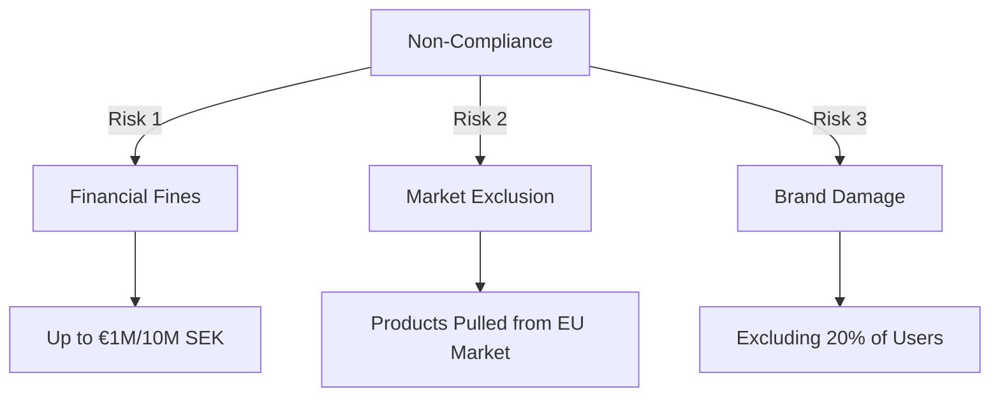

# 🚨 The Clock is Ticking: Why June 2025 Changes Everything for Digital Business

*Subtitle: The European Accessibility Act (EAA) is coming. Is your tech stack ready?*

---

**Summary:**  
The European Accessibility Act (EAA) deadline is June 28, 2025. It shifts accessibility from a "nice-to-have" to a legal requirement for private companies (e-commerce, banking, services). Non-compliance brings fines up to €1M. This article breaks down the business impact and how to prepare.

---

### The New Reality

For years, digital accessibility (a11y) has been driven by empathy or public sector regulations (WAD). In **June 2025**, the game changes. The **European Accessibility Act (EAA)** forces the private sector to comply with WCAG 2.1 Level AA.

**Who is affected?**
*   🛒 E-commerce stores
*   🏦 Banking apps & terminals
*   📺 Streaming services (Netflix, Spotify)
*   🚌 Transport services (Ticketing apps)
*   📚 E-books & Readers

### The Cost of Ignoring It

This isn't just about "doing the right thing" anymore; it's about business continuity.

*   **Sweden:** Fines up to 10,000,000 SEK.
*   **Ireland:** Fines + potential imprisonment for directors.
*   **EU-wide:** Market surveillance authorities have the power to **pull non-compliant products off the market**. Imagine your e-commerce site being blocked in Germany or France because your checkout flow isn't keyboard accessible.

### Strategic Advantage vs. Panic Compliance

Most companies will panic in Q2 2025. Smart leaders are acting now.

**The "HolmDigital Strategy":**
1.  **Audit Now:** Don't wait. Use automated scanners to find low-hanging fruit (contrast, labels).
2.  **Shift Left:** Stop designing non-compliant UIs. Train designers.
3.  **Automate:** Add accessibility checks to your CI/CD pipeline.

### Conclusion

The EAA isn't a threat; it's an opportunity to build better products for everyone. Accessible products have better SEO, cleaner code, and simpler UX.

*Is your organization ready for 2025?*

---

*Tags: #Accessibility #EAA #DigitalLaw #WebDev #Leadership #Compliance #HolmDigital*
