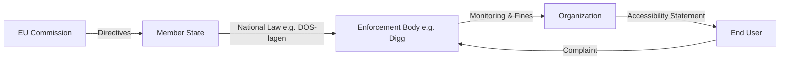

# EU Legal Framework Guide

This guide explains how @holmdigital packages integrate with EU accessibility directives.

## Two EU Directives

### WAD - Web Accessibility Directive (2016/2102)
**Applies to:** Public sector websites and mobile apps  
**In force:** Since September 2019  
**Core requirement:** WCAG 2.1 Level AA

### EAA - European Accessibility Act (2019/882)
**Applies to:** Private sector products and services  
**Deadline:** June 28, 2025  
**Scope:** E-commerce, banking, transport, e-books, streaming

## Visual Overview

### Does WAD or EAA apply?

```mermaid
graph TD
    A[Start: Analysis] --> B{Sector?}
    B -- Public Sector --> C[WAD Directive]
    B -- Private Sector --> D{Service Type?}
    D -- E-commerce / Banking / Transport / Media --> E[EAA Directive]
    D -- Other B2B / Internal Tools --> F[Not directly covered (yet)]
    C --> G[WCAG 2.1 AA Compliance]
    E --> H[WCAG 2.1 AA Compliance + Specific Functional Criteria]
    E --> I[Deadline: June 2025]
```

### Hierarchy of Enforcement



## National Implementations

| Country | WAD Law | EAA Law | Max Sanction |
|---------|---------|---------|--------------|
| 🇸🇪 SE | [DOS-lagen](https://www.riksdagen.se/sv/dokument-lagar/dokument/svensk-forfattningssamling/lag-20181937-om-tillganglighet-till-digital_sfs-2018-1937) | [LPTT](https://www.riksdagen.se/sv/dokument-lagar/dokument/svensk-forfattningssamling/lag-2023254-om-vissa-produkters-och-tjansters_sfs-2023-254) | 10M SEK |
| 🇩🇪 DE | [BITV 2.0](https://www.gesetze-im-internet.de/bitv_2_0/) | [BFSG](https://www.gesetze-im-internet.de/bfsg/) | 500k EUR |
| 🇫🇷 FR | [RGAA](https://www.legifrance.gouv.fr/loda/article_lc/LEGIARTI000037387342/) | - | 300k EUR |
| 🇪🇸 ES | UNE 139803 | - | 1M EUR |
| 🇮🇪 IE | [S.I. 358/2020](https://www.irishstatutebook.ie/eli/2020/si/358/made/en/print) | - | 60k EUR |
| 🇳🇴 NO | [IKT-forskrift](https://lovdata.no/dokument/SF/forskrift/2013-06-21-732) | - | Daily fines |
| 🇫🇮 FI | [306/2019](https://www.finlex.fi/sv/laki/ajantasa/2019/20190306) | - | Vite |
| 🇩🇰 DK | [Tilgængelighed](https://www.retsinformation.dk/eli/lta/2018/693) | - | Fines |

## Using the API

### Query National Laws

```typescript
import { 
  getNationalLaws, 
  getSanctions, 
  getMaxSanction 
} from '@holmdigital/standards';

// Get Swedish laws
const seLaws = getNationalLaws('SE');
// → [{ id: 'dos-lagen', law: 'DOS-lagen', ... }, { id: 'lptt', law: 'LPTT', ... }]

// Get sanctions for a law
const sanctions = getSanctions('lptt', 'SE');
// → { type: 'Sanktionsavgift', maxAmount: 10000000, currency: 'SEK' }

// Get the maximum sanction in a country
const max = getMaxSanction('SE');
// → { law: 'LPTT', amount: 10000000, currency: 'SEK' }
```

### Filter Rules by Framework

```typescript
import { 
  getRulesByFramework, 
  getRulesBySector,
  getEAADeadlineRules
} from '@holmdigital/standards';

// Get rules that apply to WAD (public sector)
const wadRules = getRulesByFramework('WAD');

// Get rules for private sector
const privateRules = getRulesBySector('private');

// Get rules with EAA deadline warning
const eaaRules = getEAADeadlineRules();
```

## Scan Integration

The `@holmdigital/engine` automatically includes legal context in scan results:

```typescript
import { RegulatoryScanner } from '@holmdigital/engine';

const scanner = new RegulatoryScanner({ url: 'https://example.se' });
const result = await scanner.scan();

console.log(result.legalSummary);
// {
//   wadApplicable: 23,
//   eaaApplicable: 18,
//   deadlineViolations: 5
// }
```

## Next Steps

- [Nordic Authorities Guide](./nordic-authorities-guide.md)
- [Accessibility Statement Tutorial](./accessibility-statement.md)
