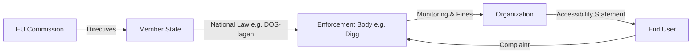

# EU Legal Framework Guide

This guide explains how @holmdigital packages integrate with EU accessibility directives.

## Two EU Directives

### WAD - Web Accessibility Directive (2016/2102)
**Applies to:** Public sector websites and mobile apps  
**In force:** Since September 2019  
**Core requirement:** WCAG 2.1 Level AA

### EAA - European Accessibility Act (2019/882)
**Applies to:** Private sector products and services  
**Deadline:** June 28, 2025  
**Scope:** E-commerce, banking, transport, e-books, streaming

## Outside EU: ADA (USA)

The **Americans with Disabilities Act of 1990 (ADA)** is the primary US framework for digital accessibility in state/local government and private sector. Unlike WAD/EAA (EU directives), ADA is federal US law enforced via the Department of Justice (DOJ) Civil Rights Division.

### ADA Title II — State & Local Government
**Applies to:** Websites, mobile apps, and digital services of state and local government entities (excluding federal agencies — see Section 508)
**Standard:** WCAG 2.1 Level AA
**Enforcement:** DOJ, Civil Rights Division
**Final rule:** 28 CFR Part 35 (DOJ, published 2024-04-24)
**Compliance deadlines:**
- **2026-04-24** for entities serving populations of 50,000+
- **2027-04-24** for entities serving populations under 50,000

### ADA Title III — Private Sector (Public Accommodations)
**Applies to:** Places of public accommodation (hotels, restaurants, retail, healthcare, e-commerce)
**Standard:** WCAG 2.1 Level AA (de facto via DOJ consent decrees and case law — Robles v. Domino's Pizza, Gil v. Winn-Dixie)
**Enforcement:** DOJ, Civil Rights Division
**Web rule:** NPRM published 2024; final rule pending

### Section 508 (parallel federal framework)
**Applies to:** Federal agencies only
**Enforcement:** General Services Administration (GSA) via Section508.gov
Not affected by the 2024 ADA final rule. Our CLI maps `--country US --sector public` to **ADA Title II + Section 508** and `--sector private` to **ADA Title III**.

## Visual Overview

### Does WAD or EAA apply?

```mermaid
graph TD
    A[Start: Analysis] --> B{Sector?}
    B -- Public Sector --> C[WAD Directive]
    B -- Private Sector --> D{Service Type?}
    D -- E-commerce / Banking / Transport / Media --> E[EAA Directive]
    D -- Other B2B / Internal Tools --> F[Not directly covered (yet)]
    C --> G[WCAG 2.1 AA Compliance]
    E --> H[WCAG 2.1 AA Compliance + Specific Functional Criteria]
    E --> I[Deadline: June 2025]
```

### Hierarchy of Enforcement



## National Implementations

The national laws for all sixteen supported countries live in `@holmdigital/standards`, in `data/legal/national-laws.json`, and are read through the API below. This guide deliberately does not repeat them.

It used to carry a table of laws and maximum sanctions per country, and the table had drifted from the data. It named a Portuguese decree that does not exist and a Spanish technical standard in place of the Spanish regulation. It also gave sanction ceilings that are not in the laws, among them 500k EUR for Germany where the BFSG states 100,000, and 300k EUR for France where the law states 50,000. A hand-written copy of legal data goes stale in exactly this way, so there is now only one source.

For the same reason there is no sanctions column anywhere in the documentation. A sanction is not one number per country: a law may state a range, a formula, a type without an amount, no penalty of its own, or no ceiling. Read it with `getSanctions(lawId, country)`. It returns `undefined` where no amount is established against primary source, which never means that no penalty exists.

## Using the API

### Query National Laws

```typescript
import { 
  getNationalLaws, 
  getSanctions, 
  getMaxSanction 
} from '@holmdigital/standards';

// Get Swedish laws
const seLaws = getNationalLaws('SE');
// → [{ id: 'dos-lagen', law: 'DOS-lagen', ... }, { id: 'lptt', law: 'Tillgänglighetslagen / LPTT', ... }]

// Get sanctions for a law (undefined where no amount is established)
const sanctions = getSanctions('lptt', 'SE');
// → { type: 'Sanktionsavgift', minAmount: 10000, maxAmount: 10000000, currency: 'SEK', ... }

// Get the maximum sanction in a country (null where no amount is established)
const max = getMaxSanction('SE');
// → { law: 'Tillgänglighetslagen / LPTT', amount: 10000000, currency: 'SEK' }
```

### Enforcement Body Lookup

```typescript
// Sector-aware enforcement body lookup
import { getEnforcementBody } from '@holmdigital/standards';

const body = getEnforcementBody('IT', 'public');
// Output: "Agency for Digital Italy (AgID)"
```

### Filter Rules by Framework

```typescript
import { 
  getRulesByFramework, 
  getRulesBySector,
  getEAADeadlineRules
} from '@holmdigital/standards';

// Get rules that apply to WAD (public sector)
const wadRules = getRulesByFramework('WAD');

// Get rules for private sector
const privateRules = getRulesBySector('private');

// Get rules with EAA deadline warning
const eaaRules = getEAADeadlineRules();
```

## Scan Integration

The `@holmdigital/engine` automatically includes legal context in scan results:

```typescript
import { RegulatoryScanner } from '@holmdigital/engine';

const scanner = new RegulatoryScanner({ url: 'https://example.se' });
const result = await scanner.scan();

console.log(result.legalSummary);
// {
//   wadApplicable: 23,
//   eaaApplicable: 18,
//   deadlineViolations: 5
// }
```

## Next Steps

- [Nordic Authorities Guide](./nordic-authorities.md)
- [Accessibility Statement Tutorial](./accessibility-statement.md)
