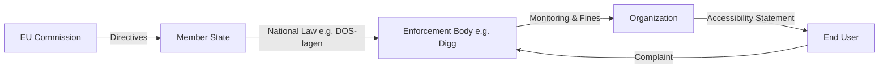

# EU Legal Framework Guide

This guide explains how @holmdigital packages integrate with EU accessibility directives.

## Two EU Directives

### WAD - Web Accessibility Directive (2016/2102)
**Applies to:** Public sector websites and mobile apps  
**In force:** Since September 2019  
**Core requirement:** WCAG 2.1 Level AA

### EAA - European Accessibility Act (2019/882)
**Applies to:** Private sector products and services  
**Deadline:** June 28, 2025  
**Scope:** E-commerce, banking, transport, e-books, streaming

## Outside EU: ADA (USA)

The **Americans with Disabilities Act of 1990 (ADA)** is the primary US framework for digital accessibility in state/local government and private sector. Unlike WAD/EAA (EU directives), ADA is federal US law enforced via the Department of Justice (DOJ) Civil Rights Division.

### ADA Title II — State & Local Government
**Applies to:** Websites, mobile apps, and digital services of state and local government entities (excluding federal agencies — see Section 508)
**Standard:** WCAG 2.1 Level AA
**Enforcement:** DOJ, Civil Rights Division
**Final rule:** 28 CFR Part 35 (DOJ, published 2024-04-24)
**Compliance deadlines:**
- **2026-04-24** for entities serving populations of 50,000+
- **2028-04-26** for entities serving populations under 50,000

### ADA Title III — Private Sector (Public Accommodations)
**Applies to:** Places of public accommodation (hotels, restaurants, retail, healthcare, e-commerce)
**Standard:** WCAG 2.1 Level AA (de facto via DOJ consent decrees and case law — Robles v. Domino's Pizza, Gil v. Winn-Dixie)
**Enforcement:** DOJ, Civil Rights Division
**Web rule:** NPRM published 2024; final rule pending

### Section 508 (parallel federal framework)
**Applies to:** Federal agencies only
**Enforcement:** General Services Administration (GSA) via Section508.gov
Not affected by the 2024 ADA final rule. Our CLI maps `--country US --sector public` to **ADA Title II + Section 508** and `--sector private` to **ADA Title III**.

## Visual Overview

### Does WAD or EAA apply?

```mermaid
graph TD
    A[Start: Analysis] --> B{Sector?}
    B -- Public Sector --> C[WAD Directive]
    B -- Private Sector --> D{Service Type?}
    D -- E-commerce / Banking / Transport / Media --> E[EAA Directive]
    D -- Other B2B / Internal Tools --> F[Not directly covered (yet)]
    C --> G[WCAG 2.1 AA Compliance]
    E --> H[WCAG 2.1 AA Compliance + Specific Functional Criteria]
    E --> I[Deadline: June 2025]
```

### Hierarchy of Enforcement



## National Implementations

| Country | WAD Law | EAA Law | Max Sanction |
|---------|---------|---------|--------------|
| 🇸🇪 SE | [DOS-lagen](https://www.riksdagen.se/sv/dokument-lagar/dokument/svensk-forfattningssamling/lag-20181937-om-tillganglighet-till-digital_sfs-2018-1937) | [LPTT](https://www.riksdagen.se/sv/dokument-lagar/dokument/svensk-forfattningssamling/lag-2023254-om-vissa-produkters-och-tjansters_sfs-2023-254) | 10M SEK |
| 🇩🇪 DE | [BITV 2.0](https://www.gesetze-im-internet.de/bitv_2_0/) | [BFSG](https://www.gesetze-im-internet.de/bfsg/) | 500k EUR |
| 🇫🇷 FR | [RGAA](https://www.legifrance.gouv.fr/loda/article_lc/LEGIARTI000037387342/) | - | 300k EUR |
| 🇪🇸 ES | UNE 139803 | - | 1M EUR |
| 🇮🇪 IE | [S.I. 358/2020](https://www.irishstatutebook.ie/eli/2020/si/358/made/en/print) | - | 60k EUR |
| 🇳🇴 NO | [IKT-forskrift](https://lovdata.no/dokument/SF/forskrift/2013-06-21-732) | - | Daily fines |
| 🇫🇮 FI | [306/2019](https://www.finlex.fi/sv/laki/ajantasa/2019/20190306) | - | Vite |
| 🇩🇰 DK | [Tilgængelighed](https://www.retsinformation.dk/eli/lta/2018/693) | - | Fines |
| 🇳🇱 NL | [Tijdelijk besluit digitale toegankelijkheid](https://wetten.overheid.nl/BWBR0040936/2018-07-01) | [Wet implementatie EU-richtlijn toegankelijkheid](https://www.eerstekamer.nl/wetsvoorstel/36461_implementatie) | 4.5M EUR |
| 🇮🇹 IT | [D.Lgs. 106/2018](https://www.gazzettaufficiale.it/eli/id/2018/09/11/18G00133/sg) | D.Lgs. 82/2024 | 5% turnover |
| 🇵🇹 PT | [Decreto-Lei n.o 83/2018](https://dre.pt/dre/detalhe/decreto-lei/83-2018-116734769) | DL 101-D/2023 | Fines |
| 🇵🇱 PL | [Ustawa o dostepnosci cyfrowej](https://isap.sejm.gov.pl/isap.nsf/DocDetails.xsp?id=WDU20190000848) | Ustawa o dostępności produktów i usług | 10k PLN |

## Using the API

### Query National Laws

```typescript
import { 
  getNationalLaws, 
  getSanctions, 
  getMaxSanction 
} from '@holmdigital/standards';

// Get Swedish laws
const seLaws = getNationalLaws('SE');
// → [{ id: 'dos-lagen', law: 'DOS-lagen', ... }, { id: 'lptt', law: 'LPTT', ... }]

// Get sanctions for a law
const sanctions = getSanctions('lptt', 'SE');
// → { type: 'Sanktionsavgift', maxAmount: 10000000, currency: 'SEK' }

// Get the maximum sanction in a country
const max = getMaxSanction('SE');
// → { law: 'LPTT', amount: 10000000, currency: 'SEK' }
```

### Enforcement Body Lookup

```typescript
// Sector-aware enforcement body lookup
import { getEnforcementBody } from '@holmdigital/standards';

const body = getEnforcementBody('IT', 'public');
// Output: "AgID - Agenzia per l'Italia Digitale"
```

### Filter Rules by Framework

```typescript
import { 
  getRulesByFramework, 
  getRulesBySector,
  getEAADeadlineRules
} from '@holmdigital/standards';

// Get rules that apply to WAD (public sector)
const wadRules = getRulesByFramework('WAD');

// Get rules for private sector
const privateRules = getRulesBySector('private');

// Get rules with EAA deadline warning
const eaaRules = getEAADeadlineRules();
```

## Scan Integration

The `@holmdigital/engine` automatically includes legal context in scan results:

```typescript
import { RegulatoryScanner } from '@holmdigital/engine';

const scanner = new RegulatoryScanner({ url: 'https://example.se' });
const result = await scanner.scan();

console.log(result.legalSummary);
// {
//   wadApplicable: 23,
//   eaaApplicable: 18,
//   deadlineViolations: 5
// }
```

## Next Steps

- [Nordic Authorities Guide](./nordic-authorities.md)
- [Accessibility Statement Tutorial](./accessibility-statement.md)
