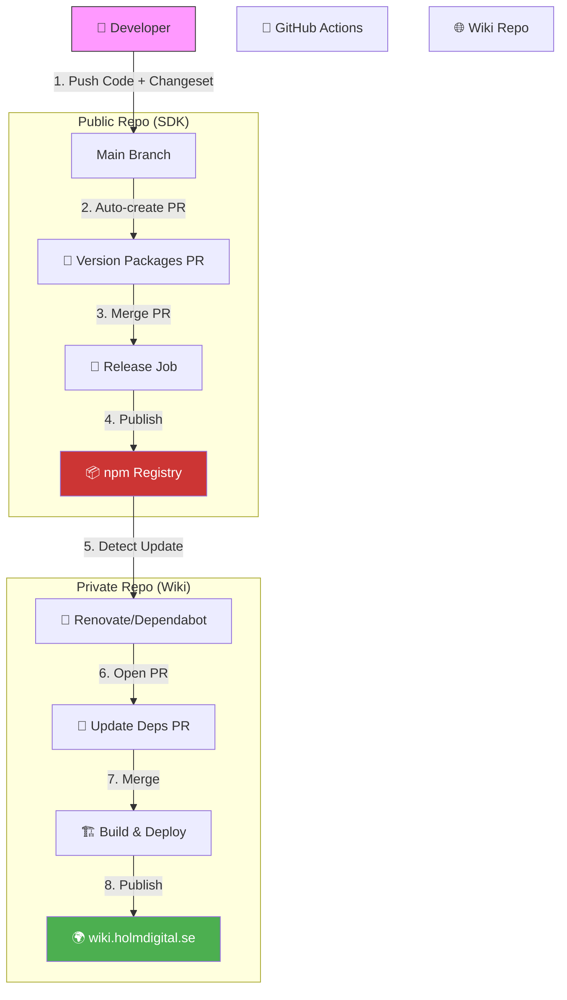

# Internal CI/CD Strategy & Automation Guide

## 1. The Monorepo "Dependency Cascade" Strategy

Since our packages (`Standards` → `Engine` → `Components`) are tightly coupled with the Wiki, our CI/CD must be smart about what runs when.

### Smart Triggers (Avoiding Waste)
Instead of running everything on every commit, we use path filters:

- **Standards changed?** → Run ALL tests (Standards, Engine, Components, Wiki). High risk.
- **Engine changed?** → Run Engine & Components tests.
- **Wiki only?** → Just build and deploy Wiki.

### 2. "Golden Path" CI Pipeline

This is the recommended structure for our `.github/workflows/main.yml`. It ensures nothing is deployed unless it is legally compliant.

```yaml
name: CI/CD Pipeline

on:
  push:
    branches: [main]
  pull_request:
    types: [opened, synchronize]

jobs:
  # 1. QUALITY GATES (Parallel)
  validate:
    runs-on: ubuntu-latest
    steps:
      - uses: actions/checkout@v4
      - uses: actions/setup-node@v4
        with: { node-version: 20, cache: 'npm' }
      - run: npm ci
      - name: Lint All
        run: npm run lint --workspaces
      - name: Test All
        run: npm run test --workspaces --if-present

  # 2. LEGAL COMPLIANCE SCAN
  compliance-scan:
    needs: validate
    runs-on: ubuntu-latest
    steps:
      - uses: actions/checkout@v4
      - name: Build Engine & Components
        run: npm run build --workspaces
      - name: Start Wiki (Test Env)
        run: npm run start --workspace=holmdigital-wiki &
      - name: Run EAA Compliance Check
        # Scans the build itself before release
        run: |
          npx @holmdigital/engine http://localhost:3000 \
            --threshold critical \
            --ci \
            --junit report.xml \
            --pdf compliance-report.pdf
      - uses: actions/upload-artifact@v4
        with: { name: 'legal-report', path: 'compliance-report.pdf' }

  # 3. AUTOMATED RELEASE (See Section 3)
  release:
    needs: compliance-scan
    if: github.ref == 'refs/heads/main'
    # ... executes npm publish automatically ...
```

## 3. Deployment to Hetzner (Wiki)

This workflow upgrades our standard deploy script to include "Intelligence" (Artifacts, Annotations).

```yaml
name: Deploy Wiki to Hetzner
# ... (See full code in conversation history or Recipe 5 adaptation) ...
# Key features:
# - Caches Chrome/Puppeteer
# - Generates PDF reports
# - Uploads JUnit results to GitHub
# - Deploys only if Compliance Scan passes
```

## 4. Solving the "Double Work" Problem: Automated npm Releases

**Problem:** Manually building, running `npm publish`, bumping versions in `package.json`, and pushing git tags is slow and error-prone.

**Solution: Changesets**
The standard for modern monorepos.

### Workflow:
1.  **Develop:** You make changes.
2.  **Intent:** You run `npx changeset` locally and type a summary (e.g., "Added EAA rules"). This creates a small Markdown file in the repo.
3.  **PR:** You push the code + the changeset file.
4.  **Merge:** When you merge to `main`:
    *   GitHub Actions sees the changeset file.
    *   It creates a **"Version Packages" Pull Request**.
    *   This PR calculates all new versions (handling dependencies automatically).
5.  **Release:** When you merge *that* "Version Packages" PR:
    *   GitHub Actions runs `npm publish`.
    *   It pushes new git tags (`v1.2.0`).
    *   It creates GitHub Releases with changelogs.

**Benefits:**
- **Zero manual publishing.**
- **Synchronized versions.**
- **Changelogs are auto-generated.**

## 5. Visual Workflow

This diagram illustrates how the Open Source SDK and Private Wiki interact via automated pipelines.


